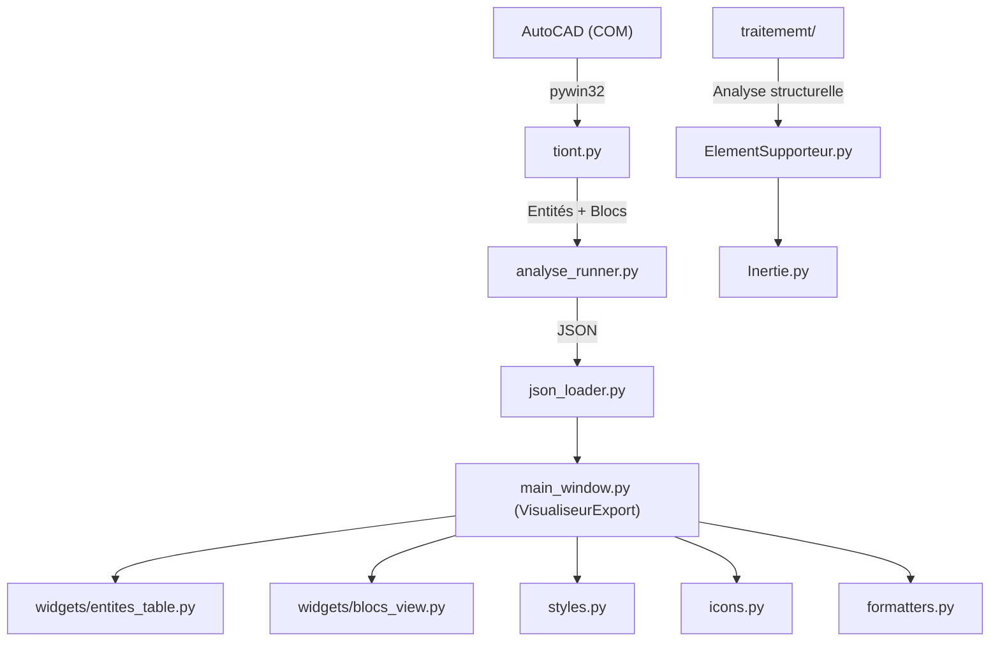

<p align="center">
  
  
  
  
</p>

# 🏗️ AutoCAD Truss Reader

**Outil d'extraction et de visualisation des données structurelles depuis AutoCAD** — conçu pour la recherche en génie civil et l'analyse de treillis 2D.

> Application desktop PyQt6 qui se connecte à AutoCAD via l'API COM Windows, extrait les entités et blocs dynamiques du dessin actif, et les présente dans une interface professionnelle inspirée des logiciels de CAO.

---

## 📋 Table des matières

- [Aperçu](#-aperçu)
- [Fonctionnalités](#-fonctionnalités)
- [Captures d'écran](#-captures-décran)
- [Architecture](#-architecture)
- [Prérequis](#-prérequis)
- [Installation](#-installation)
- [Utilisation](#-utilisation)
- [Structure du projet](#-structure-du-projet)
- [Format des données](#-format-des-données)
- [Traitement structurel](#-traitement-structurel)
- [Licence](#-licence)

---

## 🔍 Aperçu

**AutoCAD Truss Reader** est développé dans le cadre d'un mémoire de Master en génie civil. Il automatise l'extraction des données géométriques et structurelles à partir de dessins AutoCAD (`.dwg`) contenant des modèles de treillis 2D.

Le flux de travail typique :

```
AutoCAD (.dwg) ──► Extraction COM ──► Export JSON ──► Visualisation PyQt6
                                                      ──► Analyse structurelle
```

---

## ✨ Fonctionnalités

### Extraction AutoCAD
- 🔗 Connexion directe à AutoCAD via **pywin32** (COM Automation)
- 📊 Inventaire de toutes les entités du `ModelSpace`
- 🧱 Extraction complète des **blocs dynamiques** : attributs, paramètres dynamiques, géométrie des lignes internes
- 💾 Export automatique en **JSON** structuré

### Interface graphique (PyQt6)
- 🖥️ **Interface style CAO** — docks redimensionnables, barre d'outils avec icônes SVG
- 🌗 **Thème sombre / clair** — basculement instantané
- 📁 **Explorateur de fichiers** — panneau latéral avec TreeWidget et Drag & Drop
- 📝 **Panneau de propriétés** — édition en direct des valeurs sélectionnées
- 📋 **Résumé des entités** — tableau triable avec comptage par type
- 🔲 **Vue des blocs dynamiques** — onglets par type de bloc, tableaux détaillés
- 🔍 **Recherche et filtrage** — highlight en temps réel dans tous les tableaux
- 📜 **Console / Log** — suivi de l'activité en temps réel
- 📂 **Fichiers récents** — historique avec recherche et gestion complète
- 🔧 **Paramètres d'exportation** — chemin par défaut, personnalisé ou à la demande
- 📋 **Menus contextuels** — copie cellule/ligne/tout (TSV) dans chaque tableau
- 🔎 **Zoom** — slider de zoom pour les icônes de la barre d'outils
- ⌨️ **Raccourcis clavier** — `Ctrl+O`, `Ctrl+S`, `F5`, `Ctrl+T`, etc.

---

## 🖼️ Captures d'écran

> *Ajoutez ici des captures d'écran de l'application.*

```
┌──────────────────────────────────────────────────────────────┐
│ Menu Bar                                                     │
├──────────────────────────────────────────────────────────────┤
│ Toolbar  [📂 Ouvrir] [💾 Sauver] [🔄 Recharger] [⚙️ Analyse]│
├──────────┬────────────────────────────┬──────────────────────┤
│Explorer  │     Workspace (Tables)     │    Properties        │
│(Tree)    │  ┌─ Résumé Entités ──────┐ │  ┌─ Recherche ─────┐│
│          │  │ AcDbLine       │  42  │ │  │ Type: AcDbLine   ││
│          │  │ AcDbBlockRef   │  18  │ │  │ Nombre: 42       ││
│          │  │ TOTAL          │  60  │ │  │ % : 70%          ││
│          │  └────────────────┴──────┘ │  └──────────────────┘│
│          │  ┌─ Blocs Dynamiques ────┐ │                      │
│          │  │ [Element Filaire] [..] │ │                      │
│          │  └───────────────────────┘ │                      │
├──────────┴────────────────────────────┴──────────────────────┤
│ Console (Log)                                                │
├──────────────────────────────────────────────────────────────┤
│ Status Bar                                                   │
└──────────────────────────────────────────────────────────────┘
```

---

## 🏛️ Architecture



| Couche | Modules | Rôle |
|--------|---------|------|
| **Extraction** | `tiont.py` | Connexion COM à AutoCAD, lecture du ModelSpace, collecte des blocs dynamiques |
| **Orchestration** | `analyse_runner.py` | Pont entre l'UI et l'extraction, gestion des erreurs |
| **Données** | `json_loader.py`, `formatters.py` | Lecture/écriture JSON, formatage des valeurs pour affichage |
| **Interface** | `main_window.py`, `widgets/` | Fenêtre principale, tableaux, vues des blocs |
| **Style** | `styles.py`, `icons.py` | Thèmes QSS (sombre/clair), icônes SVG |
| **Traitement** | `traitememt/` | Analyse structurelle : sections, inerties, propriétés mécaniques |

---

## ⚙️ Prérequis

| Composant | Version |
|-----------|---------|
| **Python** | 3.11 ou supérieur |
| **AutoCAD** | Toute version supportant l'API COM (2018+) |
| **OS** | Windows 10 / 11 (requis pour pywin32 + COM) |

---

## 📦 Installation

### 1. Cloner le dépôt

```bash
git clone https://github.com/ChristinotLeonnel/AutoCADTrussReader.git
cd AutoCADTrussReader
```

### 2. Créer un environnement virtuel (recommandé)

```bash
python -m venv venv
venv\Scripts\activate
```

### 3. Installer les dépendances

```bash
pip install -r requirement.txt
```

Les dépendances principales :

| Package | Usage |
|---------|-------|
| `PyQt6` | Interface graphique desktop |
| `PyQt6-WebEngine` | Composant web intégré (visualisation) |
| `pywin32` | Accès à l'API COM d'AutoCAD |

---

## 🚀 Utilisation

### Lancer l'application

```bash
python main.py
```

### Ouvrir un fichier JSON existant

```bash
python main.py chemin/vers/export.json
```

### Flux de travail complet

1. **Ouvrir AutoCAD** avec un dessin `.dwg` contenant un treillis 2D
2. **Lancer l'application** `python main.py`
3. **Cliquer sur « Analyser »** (ou `F5`) — l'extraction démarre
4. **Explorer les résultats** :
   - Onglet **Résumé** : inventaire des entités par type
   - Onglet **Blocs dynamiques** : détail de chaque bloc (attributs, paramètres, géométrie)
5. **Sauvegarder** le fichier JSON pour réutilisation ultérieure

### Raccourcis clavier

| Raccourci | Action |
|-----------|--------|
| `Ctrl+O` | Ouvrir un fichier JSON |
| `Ctrl+S` | Sauvegarder |
| `F5` | Lancer l'analyse AutoCAD |
| `Ctrl+T` | Basculer thème sombre / clair |
| `Ctrl+R` | Recharger le fichier |

---

## 📁 Structure du projet

```
AutoCADTrussReader/
│
├── main.py                  # Point d'entrée de l'application
├── main_window.py           # Fenêtre principale (VisualiseurExport)
├── tiont.py                 # Extraction AutoCAD via COM API
├── analyse_runner.py        # Orchestration extraction → JSON
├── json_loader.py           # Lecture / écriture des fichiers JSON
├── formatters.py            # Formatage des valeurs (coordonnées, floats)
├── styles.py                # Thèmes QSS (sombre + clair)
├── icons.py                 # Génération des icônes SVG
├── recent_files.py          # Gestion de l'historique des fichiers récents
├── settings_manager.py      # Persistance des paramètres utilisateur
├── requirement.txt          # Dépendances Python
│
├── widgets/                 # Widgets PyQt6 réutilisables
│   ├── __init__.py
│   ├── entites_table.py     # Tableau du résumé des entités
│   └── blocs_view.py        # Vue tabulaire des blocs dynamiques
│
├── traitememt/               # Module de traitement structurel
│   ├── reader.py            # Lecture des données JSON exportées
│   ├── ElementSupporteur.py # Extraction des sections et paramètres mécaniques
│   └── Inertie.py           # Calcul des moments d'inertie
│
├── icons/                   # Icônes SVG générées automatiquement
│   ├── open.svg
│   ├── save.svg
│   ├── reload.svg
│   ├── analyse.svg
│   ├── theme.svg
│   ├── explorer.svg
│   ├── properties.svg
│   ├── zoom_in.svg
│   └── zoom_out.svg
│
└── template/
    └── 2DTruss.dwt          # Template AutoCAD pour treillis 2D
```

---

## 📄 Format des données

Le fichier JSON exporté suit ce schéma :

```json
{
  "resume_entites": {
    "AcDbLine": 42,
    "AcDbBlockReference": 18,
    "AcDbPoint": 5
  },
  "blocs_dynamiques": [
    {
      "nom": "Element Filaire",
      "layer": "Structure",
      "insertion": { "x": 0.0, "y": 0.0, "z": 0.0 },
      "lignes": [
        {
          "debut": { "x": 0.0, "y": 0.0, "z": 0.0 },
          "fin": { "x": 5.0, "y": 3.0, "z": 0.0 },
          "layer": "Structure"
        }
      ],
      "attributs": {
        "E": "210000",
        "SECTION": "IPE200"
      },
      "parametres": {
        "Longueur": 5.831,
        "Section": "IPE"
      }
    }
  ]
}
```

---

## 🔬 Traitement structurel

Le module `traitememt/` fournit des outils d'analyse mécanique :

- **`reader.py`** — Charge les données JSON et filtre les éléments porteurs (`Element Filaire`)
- **`ElementSupporteur.py`** — Extrait les paramètres de section (type, dimensions) et les propriétés mécaniques (module d'Young, longueur)
- **`Inertie.py`** — Calcul des moments d'inertie selon le type de section *(en développement)*

---

## 🎨 Thèmes

L'application supporte deux thèmes, basculables avec `Ctrl+T` :

| Propriété | Thème Sombre | Thème Clair |
|-----------|-------------|-------------|
| Fond principal | `#1E1E1E` | `#F5F5F5` |
| Panneaux | `#252526` | `#FFFFFF` |
| Bordures | `#3A3A3A` | `#CCCCCC` |
| Accent | `#007ACC` | `#0078D4` |
| Texte | `#F0F0F0` | `#1A1A1A` |

---

## 👤 Auteur

**Léonnel Calixte Christinot**

Projet de recherche de Master — Génie Civil

---

## 📝 Licence

Ce projet est développé dans un cadre académique. Voir le fichier `LICENSE` pour plus de détails.
